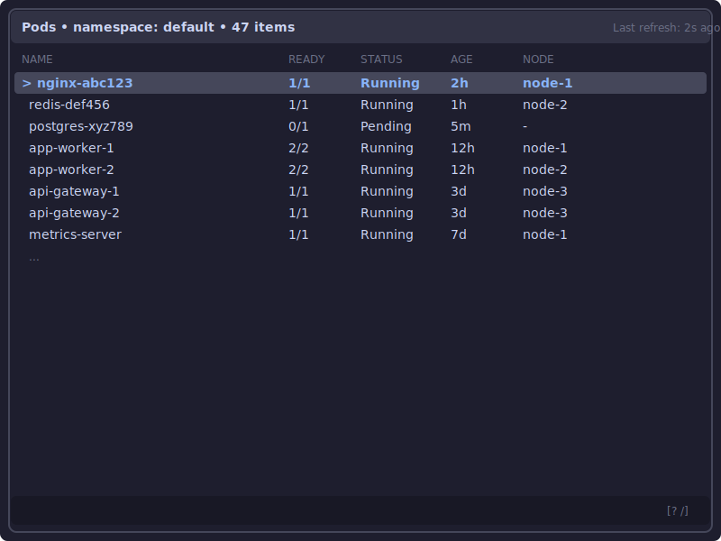
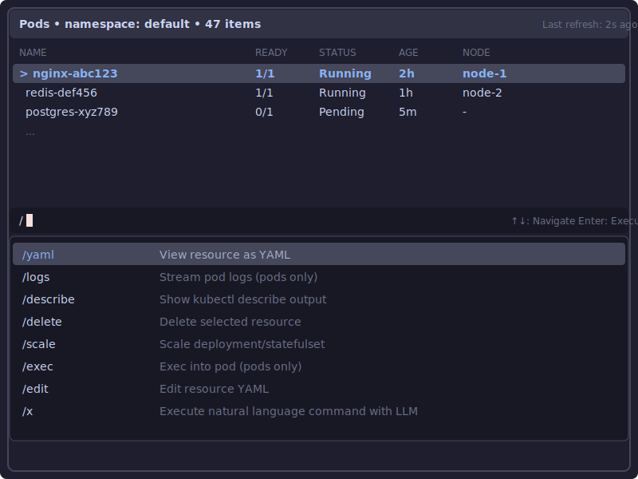
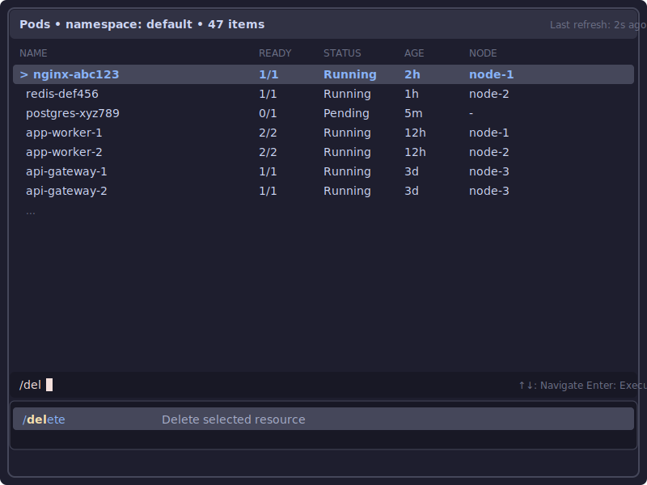
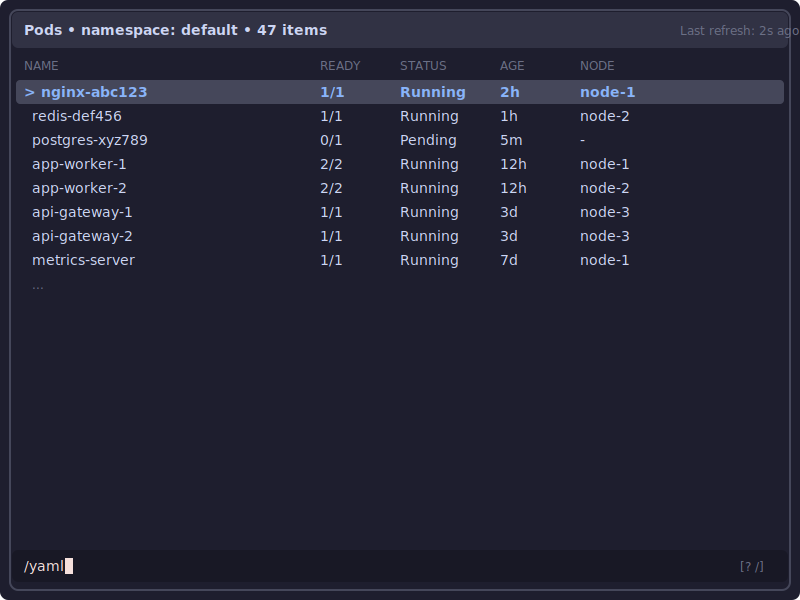
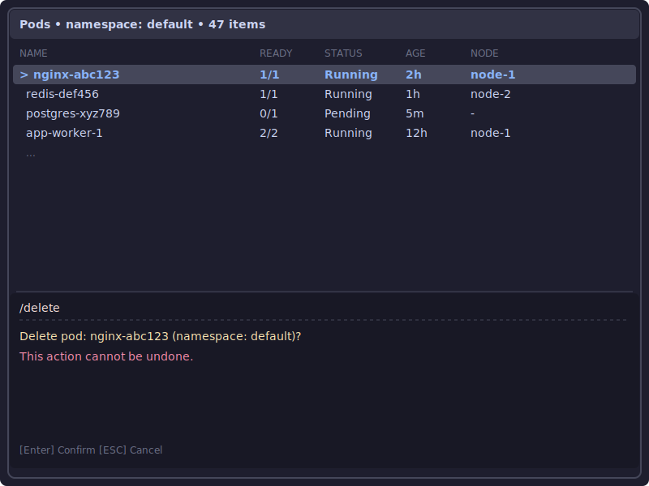
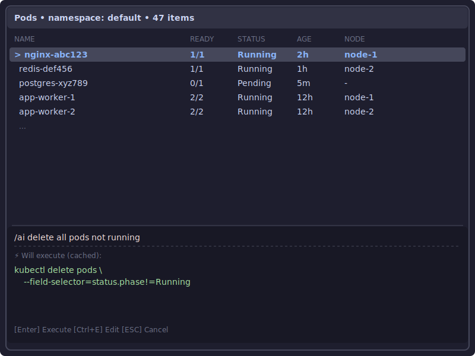
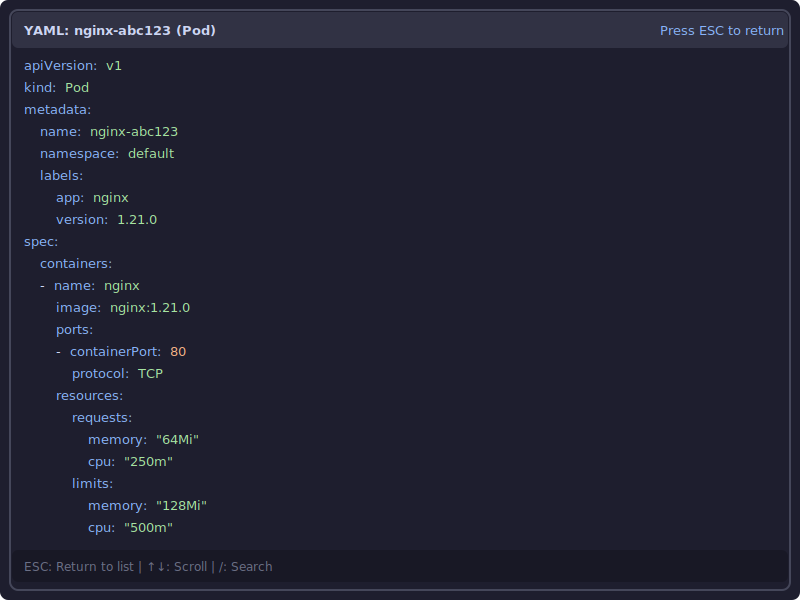

# Command-Enhanced List Browser UI/UX

| Metadata | Value                       |
|----------|-----------------------------|
| Date     | 2025-10-04                  |
| Author   | @renato0307                 |
| Status   | `Proposed`                  |
| Tags     | ui, ux, commands, llm       |
| Updates  | -                           |

| Revision | Date       | Author      | Info           |
|----------|------------|-------------|----------------|
| 1        | 2025-10-04 | @renato0307 | Initial design |

## Context and Problem Statement

Timoneiro aims to provide a TUI experience that balances between a full
UI like K9s (lists, details, operations) and a command-line interface.
The current design uses modal-based command palettes, but users need a
more fluid interaction model that combines:

1. Fast list browsing (like K9s)
2. Quick command execution (vim-style)
3. Natural language commands (LLM-powered)
4. Context-aware operations

How should we design the UI/UX to support both list-based navigation
and command-driven workflows without introducing modals or popups?

## References

Inspiration from:
- **K9s**: Resource lists with keyboard navigation
- **Claude Code**: Expandable command bar for multi-line input/output
- **Vim**: Command mode with `:` and `/` prefixes
- **Lazygit**: Context-aware command execution

## Design

### Core Concept: List Browser + Expandable Command Bar

The interface consists of two main areas:

1. **List Area**: Primary view showing Kubernetes resources (pods,
   deployments, services, etc.) with keyboard navigation and selection
2. **Command Bar**: Always-accessible input at the bottom that expands
   vertically for commands, confirmations, and results



### Command Bar States

The command bar has six distinct states:

#### State 1: Hidden (Default)

Empty bar with only hints visible on the right `[: screens  / commands]`.

#### State 2: Filter Mode

When user starts typing (without `:` or `/` prefix), the command bar
enters filter mode and filters the current list in real-time using
fuzzy matching. No palette appears - filtering happens inline.

**Features**:
- Just start typing to filter current list
- Real-time fuzzy matching on list items
- Shows filter text in command bar: `nginx-` (with cursor)
- No palette expansion - list filters in place
- **Arrow keys navigate the filtered list** (list remains interactive)
- Backspace edits filter text in command bar
- ESC clears filter and returns to hidden state
- Enter applies filter and exits filter mode (filter remains active)

#### State 3: Inline Suggestion Palette

When user presses `:` or `/`, an inline suggestion palette expands
downward from the command bar, showing all available options with
descriptions in a clean two-column layout. As the user continues
typing, the list filters in real-time using fuzzy matching.



**Features**:
- `:` shows screen/navigation options (pods, deployments, services,
  namespaces)
- `/` shows commands applicable to selected resource type (yaml, logs,
  delete, etc.)
- Clean two-column layout: option | description
- Expands downward from command bar
- **Arrow keys (↑/↓) navigate palette items** (list becomes non-interactive)
- Context-aware: `/` only shows commands for current resource type
- Fuzzy filtering as user types more characters
- Enter executes selected option
- ESC dismisses palette and returns to hidden state



**Filtering behavior**:
- Fuzzy match on command name and description
- Highlights matched characters in command names
- Dynamically resizes palette based on number of matches
- Palette shrinks to show only matching items
- When fully matched, pressing Enter executes the command

#### State 4: Direct Input Active

User types a complete command directly (`:pods`, `:ns prod`, etc.) or
continues past command selection. Single-line input with cursor.



#### State 5: Confirmation

For destructive operations (delete, scale), the bar expands to show
confirmation prompts. No modals or popups - everything inline in the
command bar.



#### State 5: LLM Preview

When using `/ai` commands, the bar expands to show:
- Original natural language input
- Generated kubectl command (with syntax highlighting)
- Cache indicator if command was previously generated
- Action buttons: Execute, Edit, Cancel



#### State 6: Result Display

Brief success/error messages shown inline. Auto-dismisses after 3s or
on ESC. Example: "✓ Scaled deployment nginx to 3 replicas"

### Command Types

#### Filter Mode (no prefix)

Default behavior - just start typing:

- `nginx` - Filters current list to items matching "nginx"
- `!running` - Excludes items matching "running" (negation)
- ESC clears filter
- Enter applies filter and exits filter mode

#### Navigation Commands (`:` prefix)

Switch between screens and views:

- `:pods` - Switch to Pods screen
- `:deployments` - Switch to Deployments screen
- `:services` - Switch to Services screen
- `:namespaces` - Switch to Namespaces screen
- `:configmaps` - Switch to ConfigMaps screen
- `:secrets` - Switch to Secrets screen
- `:ns <namespace>` - Switch namespace filter

#### Resource Commands (`/` prefix)

Standard operations on selected resource:

- `/yaml` - Show YAML (full-screen)
- `/logs` - Stream logs (full-screen, pods only)
- `/describe` - kubectl describe (full-screen)
- `/delete` - Delete selected item (confirmation)
- `/scale` - Scale deployment/statefulset (input prompt)
- `/exec` - Exec into pod (full-screen)
- `/edit` - Edit resource (full-screen YAML editor)

#### LLM Commands (`/ai` prefix)

Natural language to kubectl translation:

```
User types: /ai delete all pods not running
System:     Generates kubectl command
System:     Shows preview with confirmation
User:       Executes or edits before running
```

**Cache Strategy**:
- LLM responses cached in `~/.config/timoneiro/llm_cache.json`
- Cache key: normalized prompt (lowercase, trimmed)
- Cache includes: command, timestamp, usage count
- Cache expiry: 30 days or manual clear
- Cache hit shows ⚡ indicator (instant preview, no LLM call)

**Context Awareness**:
- Commands receive current resource type, namespace, selection
- Improves LLM accuracy and enables smarter suggestions

### Full-Screen Commands

Some commands take over the entire screen:




**Full-screen commands**:
- `/yaml` - YAML viewer (syntax highlighted, scrollable)
- `/logs` - Log streaming (live tail with color coding)
- `/describe` - kubectl describe output (formatted)
- `/edit` - YAML editor (vim-like or simple text editor)

All full-screen views:
- Show resource name in header
- Display "Press ESC to return" hint
- Return to list view on ESC
- List state preserved (selection, filter, scroll position)

### Command History

- `↑` / `↓` navigate command history
- Persists in `~/.config/timoneiro/history`
- Includes both predefined and LLM commands
- Separate history per command type (optional)

### Interaction Flow Examples

**Example 1: Quick Filter (Default)**
```
1. User is viewing Pods screen with 100 pods
2. Starts typing "nginx" (no prefix)
3. List filters in real-time to show only pods matching "nginx"
4. User navigates filtered list with arrow keys (list stays interactive)
5. Backspace to edit filter if needed
6. ESC clears filter and shows all pods again
```

**Example 2: Screen Switching with Suggestions**
```
1. User is viewing Pods screen
2. Presses ":" - inline suggestion palette appears showing all screens
3. Arrow keys navigate palette (list becomes non-interactive)
4. Types "dep" - palette filters to show ":deployments"
5. Presses Enter to select
6. Deployments screen loads
```

**Example 3: Command Discovery with Inline Palette**
```
1. User navigates list with arrow keys
2. Selects pod "nginx-abc123"
3. Presses "/" - inline command palette appears showing all commands
4. User sees list of available commands with descriptions
5. Types "del" - palette filters to show only "/delete"
6. Presses Enter to select
7. Command bar expands with confirmation prompt
8. User confirms deletion
```

**Example 4: Quick Command (Direct Input)**
```
1. User navigates list with arrow keys
2. Selects pod "nginx-abc123"
3. Types "/yaml" directly (knows the command)
4. Full-screen YAML viewer appears
5. ESC returns to list (same selection)
```

**Example 5: LLM Command (Cached)**
```
1. User types "/ai delete all failing pods"
2. Command bar expands
3. Shows: "⚡ Will execute (cached): kubectl delete pods..."
4. User presses Enter to confirm
5. Command executes
6. Result shown inline: "✓ Deleted 3 pods"
7. List refreshes automatically
```

**Example 6: Confirmation Flow**
```
1. User selects deployment "api-server"
2. Types "/delete"
3. Command bar expands with confirmation:
   "Delete deployment: api-server (namespace: prod)?"
   "This action cannot be undone."
   "[Enter] Confirm  [ESC] Cancel"
4. User presses Enter
5. Deployment deleted
6. Success message shown
7. List updated
```

**Example 7: Filter with Negation**
```
1. User viewing pods in "Running" and "Failed" states
2. Types "!running" (no prefix)
3. List filters to exclude pods matching "running"
4. Only "Failed" pods shown
5. ESC clears filter
```

### Visual Design Principles

1. **No Modals or Popups**: All interactions in command bar or
   full-screen views
2. **Bottom Command Bar**: Fixed position, always accessible by typing
3. **Filter-First Design**: Default behavior is filtering (no prefix
   needed), list stays interactive
4. **Explicit Commands**: `:` for navigation, `/` for operations
5. **Shared Focus**: Filter mode keeps list interactive (arrows navigate
   list), palette mode captures focus (arrows navigate palette)
6. **Downward Expansion**: Suggestion palette and expanded states grow
   downward from command bar, list shrinks proportionally
7. **Clean Layout**: Two-column format for palette (option |
   description)
8. **Context Preservation**: List state (selection, filter, scroll)
   maintained across command executions
9. **Progressive Disclosure**: Empty by default, expands only when
   needed
10. **Clear Action Hints**: Always show available actions in command bar
    `[Enter] Confirm  [ESC] Cancel`

## Decision

Adopt the **Command-Enhanced List Browser** pattern with:

1. **Primary list view** for resource browsing (similar to K9s)
2. **Expandable command bar** at bottom (inspired by Claude Code)
3. **Filter-first design**: Just start typing to filter (no prefix),
   list stays interactive
4. **Inline suggestion palette** for discovery (on `:` or `/` press)
5. **Four command modes**:
   - Filter mode (no prefix) - fuzzy filter current list
   - Navigation commands (`:` prefix) - screen switching, namespace
   - Resource commands (`/` prefix) - operations on selected resource
   - LLM commands (`/ai` prefix) - natural language to kubectl
6. **No modals or popups** - all interactions inline or full-screen
7. **Command history** with `↑`/`↓` navigation
8. **LLM cache** for instant previews and reduced API calls
9. **Context-aware** commands using current selection and resource type

### Command Bar Behavior

- **Fixed position**: Command bar always visible
- **Always accessible**: Just start typing
- **Filter-first**: No prefix = filter current list in real-time
- **Inline suggestion palette**: Pressing `:` shows screens/navigation,
  `/` shows resource commands, expanding downward with clean two-column
  layout
- **Downward expansion**: All expanded states (palette, confirmation,
  LLM preview) grow downward from command bar
- **Dynamic sizing**: Palette shows 1-8 items based on matches, other
  states max 10 lines
- **Confirmation inline**: Destructive operations show confirmation in
  expanded bar
- **Result display**: Brief messages auto-dismiss after 3s
- **Full-screen fallback**: Long content (logs, YAML) uses full screen

### LLM Integration

- **Cache-first**: Check cache before calling LLM API
- **Preview mandatory**: Always show generated command before execution
- **Editable**: Users can modify generated command before running
- **Contextual**: Send resource type, namespace, selection to LLM
- **Persistent**: Cache in `~/.config/timoneiro/llm_cache.json`

## Consequences

### Positive

1. **Familiar UX**: Combines best of K9s (lists) and vim (commands)
2. **No Context Switching**: Everything accessible without leaving main
   view
3. **Filter-First Design**: Most common action (filtering) requires no
   prefix - just start typing, list stays interactive
4. **Lightweight Filtering**: Arrow keys navigate list during filter
   (shared focus model)
5. **Unified Discovery**: Inline palette shows screens (`:`) and
   commands (`/`) with descriptions
6. **Clear Separation**: no prefix for filter, `:` for navigation, `/`
   for operations
7. **Smart Caching**: LLM cache reduces API calls and improves speed
8. **Fluid Interaction**: No modal dialogs interrupting workflow
9. **Progressive Complexity**: Simple for basic use, powerful for
   advanced users
10. **Natural Language**: LLM commands lower barrier for complex kubectl
    operations
11. **Context Preservation**: List state maintained across all commands
12. **Keyboard-First**: Entire interface navigable without mouse
13. **Fuzzy Search**: Real-time filtering helps find options quickly

### Negative

1. **Command Bar/Palette Size**: Large expansions may push list content
   off screen
2. **LLM Dependency**: `/ai` commands require external API (cost,
   latency, availability)
3. **Cache Management**: Need clear way to view/clear LLM cache
4. **History Complexity**: Managing history across command types may be
   confusing
5. **Learning Curve**: Users need to learn no prefix (filter), `:` for
   navigation, `/` for operations
6. **Ambiguity**: Typing might trigger unwanted filter when user
   intended to navigate list

### Mitigations

1. **Max Height Limits**: Command bar max 10 lines, palette dynamically
   sized based on matches
2. **LLM Optional**: All operations available via predefined commands
3. **Cache UI**: Add `/cache` command to view and manage cached entries
4. **Unified History**: Single history with type indicators
5. **Inline Help**: Palette always shows hints at bottom for navigation
6. **Clear Visual Feedback**: Command bar shows current mode and filter
   text clearly; easy to ESC out of filter mode

## Implementation Notes

### Command Registry

```go
type CommandType int

const (
    CommandTypeFilter     CommandType = iota  // no prefix
    CommandTypeNavigation                     // : prefix
    CommandTypeResource                       // / prefix
    CommandTypeLLM                            // /ai prefix
)

type Command struct {
    Type             CommandType
    Name             string
    Aliases          []string
    Description      string   // Shown in inline palette
    RequiresConfirm  bool
    RequiresInput    bool
    AppliesTo        []string  // ["pods", "deployments"], empty=all
    FullScreen       bool
    Handler          CommandHandler
}
```

### Command Bar Component

```go
type CommandBarState int

const (
    StateHidden CommandBarState = iota
    StateFilter              // No prefix, filtering list
    StateSuggestionPalette   // : or / pressed, showing suggestions
    StateInput               // Direct command input
    StateConfirmation        // Destructive operation confirmation
    StateLLMPreview          // /ai command preview
    StateResult              // Success/error message
)

type CommandBar struct {
    state          CommandBarState
    input          string
    inputType      CommandType   // Filter, Navigation, Resource, or LLM
    height         int           // Dynamic, max 10 lines
    history        []string
    historyIdx     int
    cache          *LLMCache

    // Suggestion palette state (for : and / modes)
    paletteVisible bool
    paletteItems   []Command     // Filtered commands/screens
    paletteIdx     int           // Selected index
}
```

### Inline Suggestion Palette

The palette component expands downward from the command bar:
- Triggered by `:` (navigation) or `/` (resource commands)
- Clean two-column layout: option name | description
- Filters using fuzzy matching (github.com/sahilm/fuzzy)
- Context-aware:
  - `:` shows all screens/navigation options
  - `/` filters by current resource type (AppliesTo field)
- Dynamically sizes based on number of matches (shows 1-8 items)
- Highlights matched characters in option names
- Arrow keys navigate, Enter selects, ESC dismisses
- Palette shrinks as filtering narrows matches
- List area above shrinks proportionally to accommodate palette

### LLM Cache Structure

```json
{
  "delete all pods not running": {
    "command": "kubectl delete pods --field-selector=...",
    "timestamp": "2025-10-04T10:23:15Z",
    "uses": 3
  }
}
```

### Full-Screen View Pattern

All full-screen views implement:
- Header with resource name and ESC hint
- Main content area (scrollable)
- Footer with additional hints
- ESC key handler to return to list

### Command History Storage

```
~/.config/timoneiro/history (plain text, one command per line)
```

### Configuration

```yaml
# ~/.config/timoneiro/config.yaml
commands:
  llm:
    enabled: true
    provider: openai  # or anthropic, etc.
    cache_ttl: 720h   # 30 days
  history:
    max_entries: 1000
ui:
  command_bar_max_height: 10
```

## Future Enhancements

1. **Command Suggestions**: Auto-complete for predefined commands
2. **LLM Learning**: Improve cache based on user edits and preferences
3. **Multi-Select**: Support batch operations on multiple resources
4. **Custom Commands**: User-defined command aliases
5. **Command Macros**: Chain multiple commands together
6. **Notification Bar**: Status updates for long-running commands
7. **Command Output History**: View previous command results
